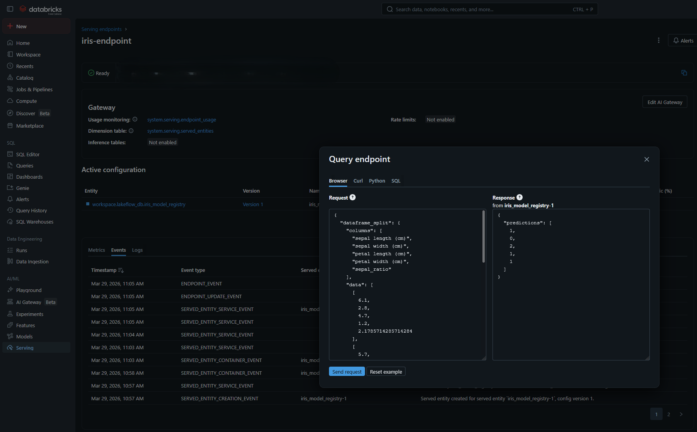

# Databricks Lakeflow - Proyecto de Aprendizaje

Este proyecto tiene como objetivo principal explorar, aprender y establecer buenas prácticas para la creación y automatización de procesos utilizando **Databricks Lakeflow** y **Databricks Asset Bundles (DABs)**.

A continuación, se listan algunas ideas de Jobs y ETLs que se desarrollarán y analizarán en este repositorio:

| Nombre del Job / ETL | Tipo             | Descripción                                                                                                                      | Factibilidad / Estado |
| -------------------- | ---------------- | -------------------------------------------------------------------------------------------------------------------------------- | --------------------- |
| **Modelo Iris**      | Machine Learning | Entrenar un modelo de prueba con el dataset Iris y registrar parámetros, métricas y resultados con MLflow gestionado por un Job. | Terminado             |

---

## 📁 Estructura del Proyecto

El repositorio fue inicializado mediante plantillas de Databricks Bundles, lo que generó la siguiente estructura recomendada:

- `src/`: Almacena el código fuente en Python (como los notebooks y scripts de extracción).
- `resources/`: Contiene la definición de tus flujos de trabajo e infraestructura como código (ej. configuración del Job `mlflow_job`).
- `tests/`: Destinado a las pruebas unitarias locales para certificar la estabilidad de tu código fuente.
- `fixtures/`: Archivos y datasets estáticos locales para usarse durante las pruebas (`tests`).

---

## 🚀 Guía de Instalación y Configuración

### 1. Instalar Databricks CLI

Databricks Asset Bundles interactúa con los workspaces de la nube mediante el CLI oficial de Databricks. Debes instalarlo en tu entorno loca:

```bash
curl -fsSL https://raw.githubusercontent.com/databricks/setup-cli/main/install.sh | sh
```

Verifica que se instaló correctamente con:

```bash
databricks -v
```

### 2. Autenticarse con el Workspace de Databricks

Debes vincular tu configuración local con la nube mediante un proceso de _Single Sign-On (SSO)_.

> **Nota para usuarios de WSL (Windows Subsystem for Linux):**
> Para que el CLI logre lanzar correctamente una pestaña del navegador de Windows desde la terminal de Ubuntu y validar la credencial, necesitas instalar `wslu`:
>
> ```bash
> sudo apt update
> sudo apt install wslu
> export BROWSER=wslview
> ```

Ejecuta el inicio de sesión y sigue los pasos en tu navegador:

```bash
databricks auth login --profile DEFAULT
```

Nota: Si comienza a arrojar el error de que el token es inválido, se deben realizar nuevamente los siguientes pasos:

```bash
export BROWSER=wslview
databricks auth login --profile DEFAULT
```

### 3. Entorno Virtual y Dependencias

Este proyecto utiliza `uv` como gestor ultrarrápido de paquetes en Python. Ubícate en este directorio y ejecuta:

```bash
# Generar un ambiente virtual de Python
uv venv

# Activar el ambiente virtual
source .venv/bin/activate

# Instalar sincronizadamente las dependencias del proyecto (incluyendo librerías de desarrollo útiles)
uv sync --dev
```

---

## 💻 Comandos Principales de Despliegue (Bundles)

Gracias a Databricks Asset Bundles, puedes controlar tus flujos de trabajo de forma declarativa desde tu consola favorita.

- **Desplegar proyecto en entorno Desarrollo (dev)**:
  Sincroniza tus cambios en Python (en tu Workspace personal) y actualiza la definición del Job sin afectar a producción.

  ```bash
  databricks bundle deploy --target dev
  ```

  _(El tag `dev` corresponde al objetivo por defecto si lo omites)._

- **Correr o Disparar Manualmente un Job**:
  Arranca una ejecución programada al instante. Te generará un enlace para seguir la evolución en la interfaz UI.

  ```bash
  databricks bundle run
  ```

- **Desplegar proyecto en Producción (prod)**:
  Impacta oficialmente los cambios en los perfiles destinados a producción.

  ```bash
  databricks bundle deploy --target prod
  ```

- **Ejecutar Pruebas Unitarias localmente**:
  Revisa si tu código funciona en el computador mediante la validación de `pytest`.
  ```bash
  uv run pytest
  ```

---

## 🌐 Servir Endpoint

Una vez ejecutado el pipeline, se debería registrar el modelo en la ruta `workspace.lakeflow_db.iris_model_registry`, por lo que al menos el esquema `lakeflow_db` debe existir en el catálogo `workspace`.

En la pantalla de **Serving**:

1. Presionar el botón **`Create serving endpoint`**.
2. En la nueva pantalla, llenar la siguiente información:
   - **General**: Nombre del endpoint.
   - **Served entities**: Presionar el campo `Select an entity`. En el popup emergente seleccionar `My models`, y en la lista desplegable `Select a model` buscar el modelo registrado o escribir manualmente `workspace.lakeflow_db.iris_model_registry`.

3. Dejar todas las otras opciones con sus valores por defecto y presionar el botón **`Create`**.

> **Nota:** Esperar unos minutos, ya que el endpoint demora un tiempo en aprovisionar los recursos y quedar listo.

Cuando esté listo para usar (en estado `Ready`), se puede probar desde la UI usando el botón **`Query endpoint`** (o equivalente como `Use`), que desplegará un panel con distintas opciones de consumo: `Browser`, `curl`, `Python` y `SQL`.

### Ejemplo de Petición (Browser)

**Input JSON:**

```json
{
  "dataframe_split": {
    "columns": [
      "sepal length (cm)",
      "sepal width (cm)",
      "petal length (cm)",
      "petal width (cm)",
      "sepal_ratio"
    ],
    "data": [[6.1, 2.8, 4.7, 1.2, 2.1785]]
  }
}
```

**Output JSON:**

```json
{
  "predictions": [1]
}
```

### Imagen de Referencia



---

## ⚠️ Consideraciones Importantes Especiales

Hasta el momento me he encontrado con las siguientes observaciones, todas aplican a Databricks Free.

- No se puede configurar Spark libremente, o al menos las siguientes opciones no se pueden utilizar:
  - `spark.sql.adaptive.enabled`
  - `spark.sql.adaptive.coalescePartitions.enabled`

- Con Great Expectations, al agregar un contexto como `context.data_sources.add_spark` no se puede usar `persist` (True por defecto), ya que intenta almacenar los pasos intermedios. Es necesario especificar `persist=False`:

```python
suite = context.suites.add(suite)
datasource = context.data_sources.add_spark(
    name="spark_in_memory", persist=False
)
```

- **Llamadas Web y Red Restringida**: Si posees una cuenta **Databricks Free Edition. Community Edition**, por defecto la red del cluster se restringe fuertemente contra sitios de internet públicos, lo que **no permite hacer llamadas a APIs externas o Web Scraping**. Para más detalles revisa este hilo en el [foro de la comunidad Databricks](https://community.databricks.com/t5/data-engineering/not-able-to-call-external-api-when-using-databricks-free-edition/td-p/126542).

---

## 📚 Enlaces de Referencia Útiles

- [Databricks CLI - Instalación CURL](https://docs.databricks.com/aws/en/dev-tools/cli/install#curl-install)
- [Databricks SDK para Python - Docs](https://databricks-sdk-py.readthedocs.io/en/latest/workspace/jobs/jobs.html)
- [Databricks Asset Bundles Settings](https://docs.databricks.com/aws/en/dev-tools/bundles/settings)
- [Ejemplos Oficiales de Proyectos Bundles](https://github.com/databricks/bundle-examples)
- [Generador / Explicador formato Quartz Cron](https://www.quartz-scheduler.org/documentation/quartz-2.3.0/tutorials/crontrigger.html)
- [Artículos: Migración desde Apache Airflow a Lakeflow Jobs](https://www.databricks.com/blog/how-move-apache-airflowr-databricks-lakeflow-jobs)
- [Ejemplo Oficial de MLflow en Databricks](https://docs.databricks.com/aws/en/notebooks/source/mlflow/mlflow3-ml-example.html)
